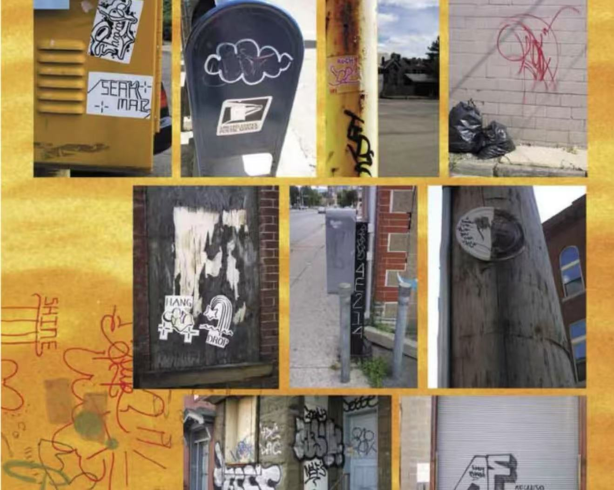

# Dove in the Dream —— Meditation

### User Input
### Group D 

| Name              | Unikey     |  
|-------------------|------------|  
| Su Lyu            | slyu0503   |

## Project Overview

This project is an individual extension of the group-coded dove dot-matrix. It transforms a static pixel image into an interactive drawing and visual experience. The work is inspired by cyberpunk aesthetics and designed to explore user interaction as a primary driver of animation.

## Animation Driver: User Input

This version uses mouse input to animate and transform the artwork. Key behaviors include:
- Clicking near particles (brush strokes) triggers a explosion effect
- Dragging the mouse leaves behind shining characters, simulating a digital graffiti trail
- No automatic motion or external timing — all changes are user-controlled

## How to Interact

- **Click** the dove dot matrix explosion
- **Drag** the mouse to draw cyberpunk-style drawing
- **Press `R`** to reset the page
- **Press `S`** to save PNG image
- **Press `Q`** to change background color

## My Individual Animation Approach

While the original group code visualized a dove with elastic particle dots, my version expands it by:
- **Adding stylized drawing interactions** using p5.js `createGraphics()`
- **Replacing grayscale dot visuals** with vibrant **cyberpunk color palettes** and characters such as `*, #, |, >, 0, 1`
- **Eliminating auto-rotation and mouse-orbit logic** to focus on user-driven effects
- **Incorporating explosion physics** with damping and recovery for each particle

These changes result in a more **expressive, interactive, and aesthetic-focused experience**, highlighting the visual pleasure of user disruption and creation.

## Technical Breakdown

- `BrushStroke` class handles particle position, explosion velocity, and recovery logic
- `addPaintMark()` uses `createGraphics()` to place shining character layers on a transparent canvas
- Color palettes use RGBA values for Cybeypunk effects
- `mousePressed` and `mouseDragged` are the triggers
- `keyPressed` supports utility shortcuts (`R`, `S`, `Q`) for interactivity

## Inspiration

- **Cyberpunk art**

- **Graffiti art**

## Repository Contents

- `sketch.js`: Main p5.js animation code
- `assets/dovefinal.png`: Image for dove
- `README.md`: This file
- `index.html`: HTML wrapper for browser launch

## Code Reference

- [https://p5js.org/](https://p5js.org/)
- Image: dove.png (group base)
- Cyberpunk Neon Color Palette [https://www.color-hex.com/color-palette/61235](https://www.color-hex.com/color-palette/61235)
- Inspiration animation [http://xhslink.com/a/DHQSJR6V48Leb](http://xhslink.com/a/DHQSJR6V48Leb)
- Developed with VS Code

> This submission is my own work and follows the academic integrity requirements of the University of Sydney.